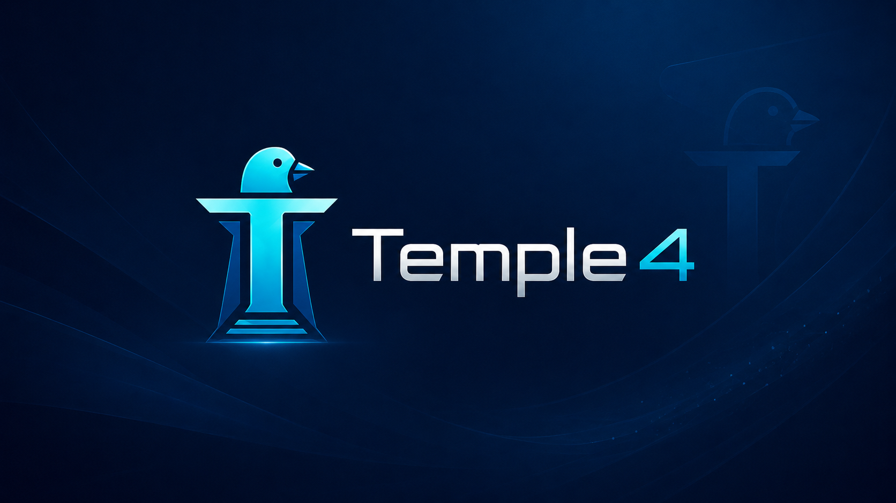
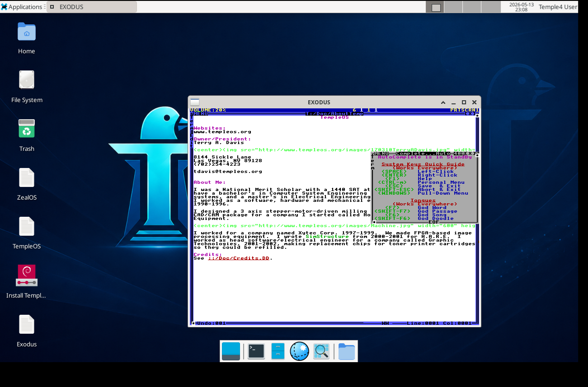

# Temple4

<p align="center">
  
</p>

<p align="center">
  <a href="https://github.com/skonester/Temple4/releases/latest">
    
  </a>
  <a href="https://github.com/skonester/Temple4/releases">
    
  </a>
</p>

<p align="center">
  <a href="LICENSE">
    
  </a>
  
  
  
</p>

<p align="center">
  
  
  
  
</p>

Temple4 is a compact live GNU/Linux system for exploring TempleOS-family
software from a familiar modern desktop. It combines a Debian Trixie userland,
a GNU Linux-libre kernel, XFCE, and ready-to-run launchers for TempleOS, ZealOS,
and Exodus.

The goal is simple: boot quickly, stay understandable, and keep the TempleOS
lineage close at hand without giving up practical Linux tools.

## Project Motivation

Temple4 comes from being moved by Terry A. Davis's story and work, and from a
practical problem: there was not a simple, ready-to-boot userland for exploring
and testing TempleOS-family systems in a straightforward way. Temple4 is meant
to make that first step easier by putting the live desktop, emulator launchers,
TempleOS-family payloads, and basic Linux tools in one small environment.

It is also meant to be a minimalist place for future users to play in. The goal
is not to build a large general-purpose distribution, but to provide a focused
space where people can boot, experiment, break things, learn, reinstall, and
keep going without needing to assemble the whole setup by hand.

## Highlights

- Debian Trixie base with a GNU Linux-libre kernel
- XFCE desktop with LightDM live-session autologin
- BIOS and UEFI boot support through ISOLINUX and GRUB
- TempleOS and ZealOS launchers using QEMU
- Native Exodus launcher
- Calamares installer integration
- NetSurf GTK as the default lightweight browser
- Fastfetch Temple4 branding
- Runtime-lite release profile that removes large nonessential desktop Debian payloads
- Bare-metal wallpaper helper for XFCE monitor-name differences

## Release Image

Temple4 is distributed as a downloadable ISO image. Download the current
release ISO, write it to a USB drive, boot it on a PC or virtual machine, and
use it as a live desktop or install it from the included installer.

<p align="center">
  <a href="https://github.com/skonester/Temple4/releases/latest">
    
  </a>
</p>

```text
Temple4.iso
```

Current release verification:

```text
File: Temple4.iso
Size: 889,210,880 bytes
SHA256: 0147f3c78dfcbc1f57ed09dfa3690c0fbad5f6882d79ece6d4806cdbacd0e00a
```

After downloading, compare the SHA256 hash of your ISO with the value above
before writing it to removable media.

## System Profile

- Base: Debian Trixie
- Kernel: GNU Linux-libre
- Desktop: XFCE
- Display manager: LightDM
- Boot: GRUB for UEFI, ISOLINUX for BIOS
- Locale: `en_US.UTF-8`
- Keyboard layout: `us`
- Browser: `netsurf-gtk`
- Terminal: `xfce4-terminal`
- Wallpaper: `/usr/share/backgrounds/temple4/Temple4.png`

Temple4 identifies itself in boot menus, `/etc/os-release`, hostname data, and
terminal fetch tools while keeping `ID_LIKE=debian` for package compatibility.

## Live Session

The live image logs into XFCE automatically:

```text
Username: user
Password: live
Display name: Temple4 User
Home: /home/user
```

Use `sudo` for administrative access:

```bash
sudo -i
```

Root credentials are also set for environments that allow direct root login:

```text
Username: root
Password: live
```

## Included Temple Tools

Temple4 includes desktop and application-menu launchers for:

- TempleOS in QEMU
- ZealOS in QEMU
- Exodus as a native Linux application

Command-line launchers are available too:

```bash
temple4-run-templeos
temple4-run-zealos
temple4-run-exodus
```

Bundled payloads are copied into the live user's home:

```text
/home/user/Terry
```

They are also available directly from the live medium:

```text
/run/live/medium/Temple4
```

## Desktop Details

XFCE requires executable desktop launchers to have trusted GVFS checksum
metadata in current Debian live sessions. Temple4 installs an autostart helper
that marks the TempleOS, ZealOS, Exodus, and installer desktop launchers as
trusted at session start:

```text
/etc/xdg/autostart/temple4-trust-desktop-launchers.desktop
```

The runtime-lite profile removes stock wallpaper collections and keeps only the
Temple4 wallpaper. XFCE-compatible paths are retained as symlinks:

```text
/usr/share/backgrounds/temple4/Temple4.png
/usr/share/backgrounds/xfce/Temple4.png
/usr/share/xfce4/backdrops/Temple4.png
```

An XFCE autostart helper reapplies the wallpaper after login and detects real
XRandR monitor names such as `HDMI-1`, `DP-1`, and `eDP-1`, which helps keep the
background correct on both VMs and bare metal:

```text
/etc/xdg/autostart/temple4-apply-wallpaper.desktop
```

## Installer

Temple4 uses Calamares to install the live system to a drive. You can install
Temple4 to an internal SSD, an external SSD, or a USB flash drive, depending on
what you want to boot from.

Launch the installer from the desktop, the app menu, or the terminal:

```bash
temple4-install
```

The old `calamares-install-debian` entry is kept as a compatibility wrapper for
systems or launchers that still look for the Debian live installer command.

### USB and SSD Install Notes

Installing to a USB drive or SSD can complete successfully even if the system
does not boot afterward. In that case, the important part is that the payload
was written: the live filesystem, Temple4 desktop files, Temple-family payloads,
and installed userland can be present on the target drive while the firmware
still fails before it reaches them. If installation appears to finish but the
machine does not boot, first reboot and re-check the firmware boot target before
treating the install as failed.


## Runtime-Lite Profile

The downloadable release uses the runtime-lite profile. It keeps the core
desktop and Temple tools while leaving out larger nonessential packages and
cached payloads, including:

- Firefox
- VLC and Audacious
- CUPS printing services
- Bluetooth/BlueZ
- Gnumeric, Geany, LazPaint, Ristretto, and Sylpheed
- CJK input/font packages
- Older non-booted kernel payloads
- Stock XFCE wallpapers
- Man pages, documentation, package caches, and extra locales

Removed software can be reinstalled later with `sudo apt install`.

## Building On Windows With WSL

The build scripts are intended to run from Windows through WSL. They do not
require a specific WSL distro; Ubuntu, Debian, Fedora, Arch, and similar WSL
environments are fine as long as the required packages are installed.

From PowerShell, install WSL if you do not already have it:

```powershell
wsl --install
```

Restart if Windows asks you to, then open your WSL distro and install the
basic build tools for that distro.

Debian or Ubuntu WSL:

```bash
sudo apt update
sudo apt install -y git git-lfs xorriso squashfs-tools syslinux-common rsync qemu-system-x86 qemu-utils ovmf
```

Fedora WSL:

```bash
sudo dnf install -y git git-lfs xorriso squashfs-tools syslinux rsync qemu-system-x86 qemu-img edk2-ovmf
```

Clone the repo from inside WSL, enter it, and pull the Git LFS assets:

```bash
git clone <repo-url> OpenTexas
cd OpenTexas
git lfs install
git lfs pull
```

Build the runtime-lite ISO:

```bash
./full_build_wsl.sh
```

The output defaults to:

```text
~/temple4_work/Temple4-runtime-lite.iso
```

For a fast boot-menu-only rebuild that skips the live filesystem repack, run:

```bash
./build_temple4_wsl.sh
```

To smoke-test the ISO in QEMU from WSL, run:

```bash
./test_iso_qemu.sh
```

The scripts check that they are running in WSL and print package-install hints
when a required command is missing. Set `ALLOW_NON_WSL=1` only if you
intentionally want to run the same scripts on a regular Linux host.

## License

Temple4 project scripts, documentation, configuration, and branding assets are
licensed under `GPL-3.0-or-later` unless a file states otherwise.

Temple4 also includes third-party free software from Debian GNU/Linux, GNU,
Linux-libre, GRUB, Syslinux, and other upstream projects. Those components keep
their original upstream licenses. See [LICENSE](LICENSE) and
[THIRD_PARTY_NOTICES.md](THIRD_PARTY_NOTICES.md) for details.


## Project Goal

Temple4 is not a replacement for TempleOS. It is a fourth temple around it: a
small live environment with a Debian Trixie userland, a GNU Linux-libre kernel,
and launchers for booting, inspecting, copying, installing, and preserving
TempleOS-family systems from a modern desktop.

## Why a Linux Live Environment?

A question that surfaces repeatedly in the TempleOS community is: *why put a
Linux live system around TempleOS at all?* That is the criticism Temple4 needs
to answer carefully. Temple4 does not make TempleOS run "on top of Linux."
TempleOS remains a separate operating system image. When launched through QEMU,
it runs as a guest machine, not as a Linux program.

The purpose of Temple4 is narrower: provide a small bootable workspace that
keeps the TempleOS-family payloads, launch commands, installer, and recovery
tools in one place. Linux is the carrier environment, not the thing being
preserved.

### Terry's Operating Environment Was a Teaching Tool

TempleOS was written by a single developer over many years. Terry's own FAQ
says he wrote the system himself and that TempleOS includes its own source,
compiler, kernel, and boot loaders rather than relying on GNU/Linux code.
That matters because TempleOS was not trying to become another conventional
Unix-like system. It was meant to be small enough to study directly, from its
kernel through its compiler and user environment.[^templeos-faq]

That same FAQ gives the practical boundary: TempleOS can run on some older
64-bit PCs, but otherwise should be run in a virtual machine such as VMware,
QEMU, or VirtualBox.[^templeos-faq] This supports Temple4's use of QEMU as a
launcher target. It does not support claiming that TempleOS is a Linux-based
system, or that Linux is part of TempleOS.

The archived TempleOS README makes the same separation in a different way: to
use TempleOS, you boot the ISO or point a virtual machine at it, and its source
is compiled by the TempleOS compiler inside that booted environment.[^templeos-readme]
That is the line Temple4 tries to preserve.

### The Host Is Not the Temple

The important distinction is between the live environment and the artifact
being studied. TempleOS itself stays independent: its FAQ says it does not
access the primary operating system's files and has no networking.[^templeos-faq]
Running TempleOS under QEMU does not turn it into a Linux application. QEMU
presents virtual hardware to a guest OS.

QEMU is relevant here because it is an open source machine emulator and
virtualizer that can present a complete virtual machine to a guest OS.[^qemu]
Temple4 uses that existing boundary instead of blurring it.

Exodus is the exception, and it should be described as such. Exodus is not
stock TempleOS booting on Linux; its own README describes it as a port of the
TempleOS kernel to userspace for x86_64 Linux, Windows, and FreeBSD, allowing
TempleOS study without a virtual machine.[^exodus] Temple4 includes Exodus
because that mode is useful for inspection and learning, while still keeping
TempleOS and ZealOS themselves in the VM/OS-image category.

### Ring 0 and Practical Access

TempleOS's ring-0 design is part of what makes it interesting. It gives the
programmer a radically direct environment, and Temple4 should not erase that
fact. But ring 0 by itself does not make a system practical as a daily driver
on modern hardware. A usable bare-metal operating system also needs device
detection, driver matching, storage, display, input, power management, and many
other pieces of hardware support. OSDev documentation describes drivers and
device management as core operating-system infrastructure, not optional polish.[^osdev-drivers][^osdev-device-management]

This is the practical problem Temple4 is trying not to hide. The archived
TempleOS README says TempleOS may require the user to manually enter I/O port
addresses for CD/DVD and hard drives, and notes that automatic detection was
too difficult for TempleOS to do reliably.[^templeos-readme] That is not a
failure of the idea; it is the cost of a small, understandable, ring-0 system
meeting messy PC hardware.

For people studying TempleOS today, there are two practical paths. One is to
run TempleOS or ZealOS as a guest OS where QEMU supplies predictable virtual
hardware. The other is to use Exodus, which deliberately moves TempleOS ideas
into userspace for study; Exodus documents that it runs in ring 3 and that
ring-0 instructions and routines are not available there.[^exodus] That trade
is honest: Exodus is less bare-metal, but it is easier to run and inspect on a
modern Linux desktop.

Temple4 chooses these paths because they are buildable and understandable now.
Trying to turn TempleOS-family work into a broadly usable ring-0 daily-driver
platform first would mean years of driver and hardware work before many people
could even begin studying the system. Temple4's argument is that practical
access brings more students and maintainers into the room sooner; deeper
bare-metal work can still happen, but it should not be the only doorway.

### Other Hosts Are Possible

Linux is not the only possible host. A BSD-based Temple4 is a reasonable
long-term goal, especially because the BSD family has a direct Unix lineage:
FreeBSD describes itself as based on 4.4BSD-Lite, and the FreeBSD project
explains BSD as an open source derivative of AT&T Research UNIX.[^freebsd-handbook][^freebsd-explaining-bsd]
illumos-based systems such as Tribblix and OpenIndiana are also real
alternatives for people who want to experiment with a Solaris-descended
userland. Tribblix describes itself as an illumos-derived distribution with a
retro style and modern components, while OpenIndiana is an illumos-based
continuation of the OpenSolaris line with technologies such as ZFS and
DTrace.[^tribblix][^openindiana]

Those hosts may be the "purer" answer for someone who wants to avoid the Linux
ecosystem while still using a serious Unix-like system. But they do not remove
the central compromise: TempleOS would still be running as a guest in a VM,
because Tribblix and OpenIndiana are complete operating systems with their own
kernels, drivers, and privileged hardware layer. The ring-0 machine would be
the illumos host; Terry's OS would still be behind virtual hardware unless it
booted bare metal.

They also shift the project toward a smaller audience. Tribblix says it is
familiar to people who have used Solaris in the past, and OpenIndiana documents
itself as an illumos/OpenSolaris continuation.[^tribblix][^openindiana] That
history is valuable, but it makes those systems better fits for legacy SunOS,
Solaris, and illumos enthusiasts than for a first TempleOS-family study image.
BSD has a broader modern hobbyist audience than illumos, so it remains a better
long-term target for a non-Linux Temple4 branch. For the current release,
though, Linux is the cleaner and easier path: it gives the project common live
media tooling, QEMU packages, installer support, and a build path more people
can reproduce.

At the end of the day, all of these choices are still living in the long shadow
of older time-sharing systems. BSD, Solaris/illumos, and Linux are all Unix,
Unix-descended, or Unix-like systems shaped by design ideas from the 1970s
minicomputer and mainframe era.[^unix-history][^freebsd-explaining-bsd][^openindiana]
Temple4 is not pretending one branch is spiritually pure and the others are
not. It is choosing the host lineage that gets out of the way fastest for the
people trying to study TempleOS-family work now.


## Sources

[^templeos-faq]: TempleOS FAQ mirror, including notes on authorship, VM use, no networking, and independence from GNU/Linux code: <https://tinkeros.github.io/WbTempleOS/Doc/FAQ.html>
[^templeos-readme]: Archived TempleOS README mirror: <https://github.com/cia-foundation/TempleOS>
[^qemu]: QEMU documentation, "About QEMU": <https://www.qemu.org/docs/master/about/index.html>
[^osdev-drivers]: OSDev Wiki, "Category:Drivers": <https://wiki.osdev.org/Category:Drivers>
[^osdev-device-management]: OSDev Wiki, "Device Management": <https://wiki.osdev.org/Device_Management>
[^linux-libre]: Free Software Directory entry for GNU Linux-libre: <https://directory.fsf.org/wiki/Linux-libre>
[^tribblix]: Tribblix "About": <https://tribblix.org/about.html>
[^openindiana]: OpenIndiana documentation, "About OpenIndiana": <https://docs.openindiana.org/misc/openindiana/>
[^freebsd-handbook]: FreeBSD Handbook, "Introduction": <https://docs.freebsd.org/en/books/handbook/introduction/>
[^freebsd-explaining-bsd]: FreeBSD documentation, "Explaining BSD": <https://docs.freebsd.org/en/articles/explaining-bsd/>
[^unix-history]: Computer History Wiki, "UNIX": <https://gunkies.org/wiki/UNIX>
[^zealos]: ZealOS README: <https://github.com/Zeal-Operating-System/ZealOS>
[^exodus]: EXODUS README: <https://github.com/aiwnios/EXODUS>
[^debian-trixie]: Debian "trixie" release information: <https://www.debian.org/releases/trixie/>
[^debian-qemu]: Debian Trixie `qemu-system-x86` package: <https://packages.debian.org/trixie/qemu-system-x86>
[^debian-xorriso]: Debian Trixie `xorriso` package: <https://packages.debian.org/trixie/xorriso>
[^debian-squashfs]: Debian Trixie `squashfs-tools` package: <https://packages.debian.org/trixie/squashfs-tools>
[^debian-grub]: Debian Trixie `grub-efi-amd64` package: <https://packages.debian.org/trixie/amd64/grub-efi-amd64>
[^debian-syslinux]: Debian Trixie `syslinux` package: <https://packages.debian.org/trixie/syslinux>
[^debian-calamares]: Debian Trixie `calamares` package: <https://packages.debian.org/trixie/calamares>

## Screenshot


