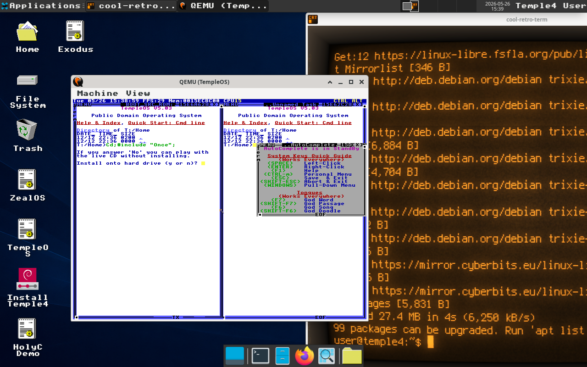

# Temple4

<p align="center">
  
</p>

<p align="center">
  <a href="https://github.com/skonester/Temple4/releases/latest">
    
  </a>
  <a href="https://github.com/skonester/Temple4/releases">
    
  </a>
  <a href="https://github.com/skonester/Temple4/releases">
    
  </a>
</p>

<p align="center">
  <a href="LICENSE">
    
  </a>
  
  
  
</p>

<p align="center">
  
  
  
</p>

Temple4 is a compact live GNU/Linux system for exploring TempleOS-family
software from a familiar modern desktop. It combines a Debian Trixie userland,
a GNU Linux-libre kernel, XFCE, and ready-to-run launchers for TempleOS,
ZealOS, Exodus, and HolyC-for-Linux.

The goal is practical access: boot quickly, stay understandable, and keep the
TempleOS lineage close at hand without asking users to assemble the emulator,
payloads, desktop shortcuts, installer, and Linux tooling by hand.

## Highlights

- Debian Trixie base with a GNU Linux-libre kernel
- XFCE desktop with LightDM live-session autologin
- BIOS and UEFI boot support through ISOLINUX and GRUB
- TempleOS and ZealOS launchers using QEMU with persistent qcow2 storage
- Native Exodus launcher when the Exodus appliance package is present
- TOOM launcher for the TempleOS DOOM port through Exodus
- TOOM-in-TempleOS launcher with a persistent QEMU disk and transfer drive
- HolyC-for-Linux wrapper and demo through `holyc` and `holyc-demo`
- Holy-Linux launcher for a HolyC-oriented Linux userspace guest in QEMU
- Calamares installer integration through `temple4-install`
- Cool Retro Term wrapper as the default terminal
- Firefox ESR as the default browser
- ConnMan network management
- TempleOS icon, cursor, wallpaper, and font assets adapted for XFCE
- Fastfetch Temple4 branding when `fastfetch` is available in the image
- Nouveau/NVK/Zink-oriented graphics package set with NVIDIA firmware
- Runtime-lite release profile that removes large nonessential desktop payloads

## Release Image

Temple4 is distributed as a downloadable ISO image. Download the current
release ISO, write it to a USB drive, boot it on a PC or virtual machine, and
use it as a live desktop or install it from the included installer.

<p align="center">
  <a href="https://github.com/skonester/Temple4/releases/latest">
    
  </a>
</p>

```text
Temple4-runtime-lite.iso
```

Current release verification:

```text
File: Temple4-runtime-lite.iso
Size: 1,218,756,608 bytes
SHA256: 164830434571ed9dc18ec4125b1d163fb251a42e954856e3f0032a09e3923543
```

After downloading, compare the SHA256 hash of your ISO with the value above
before writing it to removable media.

## System Profile

- Base: Debian Trixie
- Kernel: GNU Linux-libre
- Desktop: XFCE
- Display manager: LightDM
- Boot: GRUB for UEFI, ISOLINUX for BIOS
- Locale: `en_US.UTF-8`
- Keyboard layout: `us`
- Browser: `firefox-esr`
- Terminal wrapper: `temple4-terminal`
- Preferred terminal: `cool-retro-term`
- Network manager: ConnMan
- Icon theme: `TempleOS`
- Cursor theme: `TempleOS_Cursor`
- UI font: `TempleOS 10`
- Wallpaper: `/usr/share/backgrounds/temple4/Temple4.png`

Temple4 identifies itself in boot menus, `/etc/os-release`, hostname data, and
terminal fetch tools while keeping `ID_LIKE=debian` for package compatibility.

## Live Session

The live image logs into XFCE automatically:

```text
Username: user
Password: live
Display name: Temple4 User
Home: /home/user
```

Use `sudo` for administrative access:

```bash
sudo -i
```

Root credentials are also set for environments that allow direct root login:

```text
Username: root
Password: live
```

## Included Temple Tools

Temple4 includes desktop and application-menu launchers for:

- TempleOS in QEMU
- ZealOS in QEMU
- Exodus as a native Linux application
- TOOM through the Exodus TempleOS appliance
- TOOM in real TempleOS through QEMU
- HolyC-for-Linux as a local command and demo
- Holy-Linux as a QEMU terminal guest
- Cool Retro Term as the default Linux terminal
- The Temple4 installer

Command-line launchers are available too:

```bash
temple4-run-templeos
temple4-run-zealos
temple4-run-exodus
temple4-run-toom
temple4-run-toom-templeos
temple4-toom-wad
temple4-run-holy-linux
holyc
holyc-demo
temple4-terminal
temple4-install
```

Bundled TempleOS-family ISO payloads are copied into the live user's home:

```text
/home/user/Terry
```

They are also available directly from the live medium:

```text
/run/live/medium/Temple4
```

Installer packages from the payload folder are used during image creation or
kept on the ISO payload area, but raw `.deb` and `.rpm` files are removed from
`/home/user/Terry` and `/etc/skel/Terry` before the final live filesystem is
packed.

The TempleOS and ZealOS QEMU launchers create persistent disks in the user's
home directory, so the same launcher behavior works from both the live session
and an installed Temple4 system:

```text
~/TempleOS/TempleOS/TempleOS.qcow2
~/TempleOS/ZealOS/ZealOS.qcow2
```

## Desktop Details

XFCE requires executable desktop launchers to have trusted GVFS checksum
metadata in current Debian live sessions. Temple4 installs an autostart helper
that marks the TempleOS, ZealOS, Exodus, HolyC Demo, and installer desktop
launchers as trusted at session start:

```text
/etc/xdg/autostart/temple4-trust-desktop-launchers.desktop
```

The runtime-lite profile removes stock wallpaper collections and keeps only the
Temple4 wallpaper. XFCE-compatible paths are retained as symlinks:

```text
/usr/share/backgrounds/temple4/Temple4.png
/usr/share/backgrounds/xfce/Temple4.png
/usr/share/xfce4/backdrops/Temple4.png
```

An XFCE autostart helper reapplies the wallpaper after login and detects real
XRandR monitor names such as `HDMI-1`, `DP-1`, and `eDP-1`, which helps keep the
background correct on both VMs and bare metal:

```text
/etc/xdg/autostart/temple4-apply-wallpaper.desktop
```

## Installer

Temple4 uses Calamares to install the live system to a drive. You can install
Temple4 to an internal SSD, an external SSD, or a USB flash drive, depending on
what you want to boot from.

Launch the installer from the desktop, the app menu, or the terminal:

```bash
temple4-install
```

The old `calamares-install-debian` entry is kept as a compatibility wrapper for
systems or launchers that still look for the Debian live installer command.

The Calamares package module is configured with a dummy backend so offline
installs do not fail while trying to reach package repositories. The installer
also removes `nomodeset` leftovers from generated bootloader configuration so
kernel mode setting can initialize on installed systems.

## Graphics

Temple4 includes the open-source Nouveau/NVK-oriented graphics stack used by
Debian packages, including `xserver-xorg-video-nouveau`, Mesa Vulkan/OpenGL
packages, `vulkan-tools`, `mesa-utils`, and NVIDIA firmware packages. The image
removes software-rendering Vulkan/OpenGL fallback files from the live
filesystem as part of the runtime-lite profile.

The build script only enables Debian `main` and `non-free-firmware` components
inside the live image. If you want proprietary NVIDIA drivers on an installed
Temple4 system, you will need to manage that as a post-install Debian
configuration task, including repository components, kernel/header choices, and
DKMS module requirements. Temple4's release build pins standard Debian kernel
packages during image construction so the live image keeps the GNU Linux-libre
kernel by default.

## Runtime-Lite Profile

The downloadable release uses the runtime-lite profile. It keeps the core
desktop and Temple tools while leaving out larger nonessential packages and
cached payloads, including:

- Falkon and NetSurf browsers
- Synaptic package manager
- XPDF reader
- L3afpad editor
- VLC and Audacious
- CUPS printing services
- Bluetooth/BlueZ
- Gnumeric, Geany, LazPaint, Ristretto, and Sylpheed
- CJK input/font packages
- Standard non-GNU kernel modules and boot files
- Stock XFCE wallpapers
- Man pages, info pages, help files, package caches, and extra locales

Removed software can be reinstalled later with `sudo apt install`.

## Repository Layout

```text
build_temple4_wsl.sh      Release ISO remaster script for Debian WSL
scripts/wsl_common.sh     WSL/build-host helper functions
Temple4/                  Source ISO tree used as the remaster base
CIA Protected/            Local TempleOS-family payloads copied into the ISO
third_party/              Bundled source/assets used by the build
docs/                     Reference configs and troubleshooting notes
Temple4-runtime-lite.iso  Current generated runtime-lite ISO
Temple4.png               Branding image and live wallpaper source
screenshot.png            Desktop screenshot
```

Large ISO, squashfs, kernel, `.deb`, `.rpm`, and image payloads are tracked
through Git LFS according to `.gitattributes`.

## Building On Windows With WSL

The build script is designed to run from Windows through Debian WSL. Other
distributions are not supported for release builds.

From PowerShell, install Debian WSL if you do not already have it:

```powershell
wsl --install -d Debian
```

Restart if Windows asks you to, then open Debian WSL. Install the host-side
build tools:

```bash
sudo apt update
sudo apt install -y git git-lfs xorriso squashfs-tools syslinux-common rsync qemu-system-x86 qemu-utils ovmf
```

Clone the repo from inside WSL, enter it, and pull the Git LFS assets:

```bash
git clone <repo-url> Temple4
cd Temple4
git lfs install
git lfs pull
```

Build the runtime-lite ISO:

```bash
./build_temple4_wsl.sh
```

The script repacks the live filesystem, installs Temple4 runtime packages,
applies the lite strip profile, uses `/tmp/temple4_work` as scratch space, and
writes the ISO next to the script:

```text
Temple4-runtime-lite.iso
```

Run it as your regular Debian WSL user; it will re-exec through `sudo` for the
live filesystem repack and then hand the output back to the checkout owner. It
also works when launched as root with `wsl.exe -d Debian -u root`.

## Why A Linux Live Environment?

Temple4 does not make TempleOS run on top of Linux. TempleOS and ZealOS remain
separate operating system images launched through QEMU, where they run as guest
systems behind virtual hardware. Their launchers still boot from the bundled ISO
payloads, but attach reusable qcow2 disks under `~/TempleOS` so installs and
guest-side changes survive across launches. Exodus is different: it is a
userspace port of TempleOS concepts for Linux, Windows, and FreeBSD, and
Temple4 includes it as a separate study tool.

Holy-Linux sits between those models. Temple4 installs it under
`/opt/holy-linux` and launches it in its own terminal as a tiny QEMU guest using
Holy-Linux's direct Linux kernel plus initramfs path. Temple4 does not use
Holy-Linux's UEFI disk image or bootloader path, because Temple4 is already a
full bootable distribution.

TOOM is a TempleOS DOOM source port, so Temple4 keeps two launch paths. The
desktop `TOOM` launcher routes it through Exodus as the userspace path. The
application menu also includes `TOOM in TempleOS`, which boots the real
TempleOS ISO in QEMU, creates a persistent disk at `~/TempleOS/TOOM`, and
attaches a generated TOOM transfer CD containing TOOM plus `RunTOOM.HC`. If
TempleOS does not auto-open the transfer CD, run `#include "U:/RunTOOM.HC";`
inside TempleOS to copy TOOM into `C:/Home/TOOM` and start `SinglePlayer.HC`.
If the TOOM CD appears under another drive letter, use that drive letter instead.

The build installs TOOM under `/opt/toom` for reference. The first Exodus TOOM
launch creates a writable copy at `~/TOOM`, then starts Exodus with a temporary
`Once.HC` that includes `SinglePlayer.HC`. Use `temple4-toom-wad` or the TOOM
WAD Setup menu item to pick a replacement WAD file; it installs the selected WAD
as `~/TOOM/doom1.wad` and can launch TOOM immediately afterward.

Linux is the carrier environment here. It gives the project reproducible live
media tooling, QEMU packages, installer support, common hardware support, and a
build path more users can reproduce. Temple4 is not a replacement for TempleOS;
it is a small live workspace for booting, inspecting, copying, installing, and
preserving TempleOS-family systems from a modern desktop.

## License

Temple4 project scripts, documentation, configuration, and branding assets are
licensed under `GPL-3.0-or-later` unless a file states otherwise.

Temple4 also includes third-party free software from Debian GNU/Linux, GNU,
Linux-libre, GRUB, Syslinux, and other upstream projects. Those components keep
their original upstream licenses. See [LICENSE](LICENSE) and
[THIRD_PARTY_NOTICES.md](THIRD_PARTY_NOTICES.md) for details.

## Sources

- TempleOS FAQ mirror: <https://tinkeros.github.io/WbTempleOS/Doc/FAQ.html>
- Archived TempleOS README mirror: <https://github.com/cia-foundation/TempleOS>
- ZealOS README: <https://github.com/Zeal-Operating-System/ZealOS>
- EXODUS README: <https://github.com/aiwnios/EXODUS>
- QEMU documentation: <https://www.qemu.org/docs/master/about/index.html>
- GNU Linux-libre entry: <https://directory.fsf.org/wiki/Linux-libre>
- Debian Trixie release information: <https://www.debian.org/releases/trixie/>

## Screenshot


